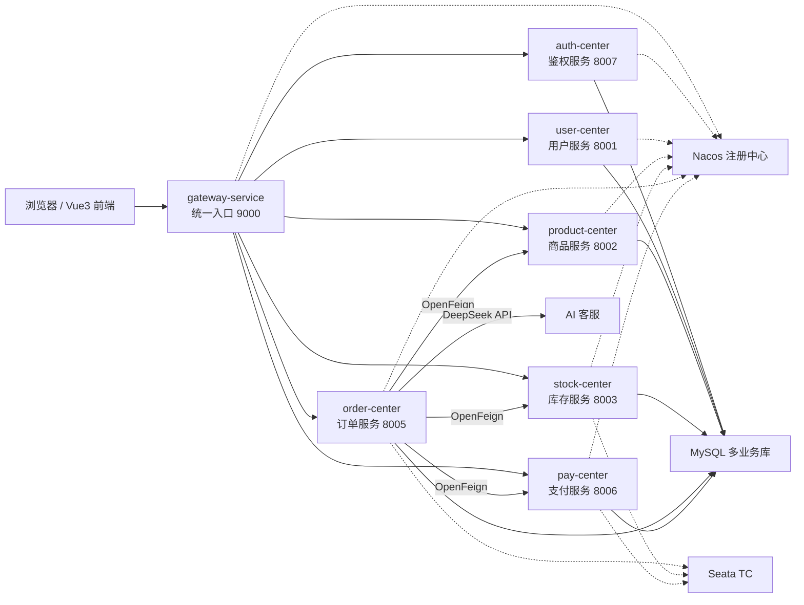

# 企业级智能分销与订单履约平台

本项目是一个面向实训答辩与演示的企业级智能分销与订单履约平台。系统采用前后端分离与 Spring Cloud 微服务架构，围绕商品、库存、订单、支付、用户、鉴权、服务治理、分布式事务和 AI 客服等业务场景展开，实现从单体练习到微服务拆分、服务注册发现、统一网关、跨服务调用、限流降级、分布式事务、智能客服和 Docker 一键部署的完整链路。

项目最终交付形态由两个核心目录组成：

- `distribution-platform`：Java 后端微服务工程。
- `frontend`：Vue3 前端工程。

此外，根目录提供 Docker Compose、启动脚本、部署文档、Nacos 控制中心文档和实训过程资料，便于在另一台电脑上快速迁移和演示。

## 项目亮点

- 使用 Spring Boot 3 + Java 21 搭建多模块微服务系统。
- 使用 Nacos 实现服务注册发现和配置中心演示。
- 使用 OpenFeign 按服务名完成订单、商品、库存、支付之间的远程调用。
- 使用 Spring Cloud Gateway 作为统一入口，完成路由转发、跨域配置和 JWT 统一鉴权。
- 使用 MyBatis-Plus 操作 MySQL，按业务拆分多个数据库。
- 使用 Sentinel 对库存扣减等接口做限流降级演示。
- 使用 Seata AT 模式完成创建订单、扣减库存、创建支付单的分布式事务演示。
- 使用 DeepSeek API 接入 AI 客服，支持订单查询、商品推荐和本地降级回复。
- 使用 Vue3 + Vite 实现深色后台管理界面，页面数据优先来自真实后端接口。
- 使用 Docker Compose 一键启动 MySQL、Redis、Nacos、Seata、后端服务和前端服务。

## 技术栈

| 层级 | 技术 |
| --- | --- |
| 前端 | Vue3、Vite、Vue Router、Axios、原生 CSS |
| 后端 | Java 21、Spring Boot 3.2.x、Spring Cloud、Spring Cloud Alibaba |
| 持久层 | MySQL 8、MyBatis-Plus |
| 服务治理 | Nacos、OpenFeign、Gateway、Sentinel |
| 分布式事务 | Seata AT |
| 鉴权 | JWT、Gateway GlobalFilter |
| 缓存与基础设施 | Redis、Docker、Docker Compose |
| AI 能力 | DeepSeek API、本地降级策略 |
| 文档与测试 | Markdown、接口测试文档、Docker smoke 脚本 |

## 系统架构



## 后端服务说明

| 服务 | 端口 | 数据库 | 主要职责 |
| --- | --- | --- | --- |
| `gateway-service` | `9000` | 无 | 统一入口、路由转发、JWT 鉴权、跨域处理、服务治理聚合 |
| `auth-service` / `auth-center` | `8007` | `auth_db` | 登录认证、JWT 生成、JWT 校验 |
| `user-service` / `user-center` | `8001` | `user_db` | 用户列表、用户详情、用户基础数据 |
| `product-service` / `product-center` | `8002` | `product_db` | 商品列表、商品详情、商品新增、上下架、配置中心演示 |
| `stock-service` / `stock-center` | `8003` | `stock_db` | 库存查询、库存扣减、Sentinel 限流、Seata RM |
| `order-service` / `order-center` | `8005` | `order_db` | 订单看板、订单列表、跨服务详情、AI 客服、Seata TM |
| `pay-service` / `pay-center` | `8006` | `pay_db` | 支付单查询、支付单创建、Seata RM |

## 前端页面

前端位于 `frontend`，主要页面包括：

| 页面 | 说明 |
| --- | --- |
| 登录页 | 使用 `auth-center` 登录，获取 JWT token |
| 今日订单看板 | 展示今日订单、今日成交额、待发货、异常订单等指标 |
| 订单履约列表 | 展示订单状态、支付服务、物流状态等信息 |
| 商品管理 | 商品列表、新增商品、上架、下架 |
| 库存查询 | 查询商品库存和仓库库存 |
| 服务治理 | 展示 Nacos 注册服务、Gateway 路由、服务延迟、实例状态 |
| 系统监控 | 展示系统组件、数据库、网关访问和技术栈信息 |
| 分布式事务链路 | 展示 Seata TC、TM、RM、undo_log 和事务审计记录 |
| AI 客服 | 支持智能问答、订单查询、商品推荐和降级回复 |

## 目录结构

```text
.
├── distribution-platform/          # Java 微服务父工程
│   ├── auth-service/               # 鉴权服务
│   ├── gateway-service/            # 网关服务
│   ├── user-service/               # 用户服务
│   ├── product-service/            # 商品服务
│   ├── stock-service/              # 库存服务
│   ├── order-service/              # 订单服务
│   ├── pay-service/                # 支付服务
│   ├── sql/                        # 初始化 SQL、Seata undo_log、乱码修复脚本
│   ├── Dockerfile                  # 后端多模块 Docker 构建文件
│   └── pom.xml                     # 后端父级 Maven 配置
├── frontend/                       # Vue3 前端工程
│   ├── src/api/                    # Axios 接口封装
│   ├── src/views/                  # 页面视图
│   ├── src/components/             # 公共组件
│   ├── Dockerfile                  # 前端 Docker 构建文件
│   └── package.json
├── docs/                           # 实训资料、接口文档、最终部署说明
│   └── final/                      # 最终架构文档与部署说明
├── scripts/                        # Docker 启停、构建和冒烟测试脚本
├── docker-compose.yml              # 一键启动完整系统
├── .env.example                    # Docker 环境变量模板
├── 远程Nacos控制中心内容.md          # 提交要求中的 Nacos 控制中心文档
└── README.md
```

说明：`day1-monolith` 是前期单体项目练习留档，最终演示和提交以 `distribution-platform` 与 `frontend` 为主。

## 一键启动

推荐使用 Docker Compose 启动完整系统，适合本机演示和换电脑答辩。

### 1. 环境要求

演示电脑需要安装：

- Docker Desktop
- Docker Compose
- Git

如果只使用 Docker 一键启动，不要求本机安装 Java、Maven、Node.js 或 MySQL。

### 2. 准备环境变量

在项目根目录执行：

```bash
cp .env.example .env
```

如果需要 AI 客服使用 DeepSeek 在线模型，编辑 `.env`：

```properties
DEEPSEEK_API_KEY=你的真实 DeepSeek API Key
```

如果不填写真实 Key，AI 客服仍可使用本地降级回复，页面会显示“降级可用”。

### 3. 启动系统

```bash
./scripts/docker-up.sh
```

首次启动会自动完成：

- 构建后端 Jar。
- 构建前端静态资源。
- 启动 MySQL、Redis、Nacos、Seata。
- 启动 7 个后端微服务。
- 启动 Vue3 前端服务。
- 初始化数据库表和模拟数据。

### 4. 访问地址

默认端口如下：

| 页面 / 服务 | 地址 |
| --- | --- |
| 前端系统 | `http://localhost:5173` |
| Gateway | `http://localhost:9000` |
| Nacos 控制台 | `http://localhost:8848/nacos` |
| Seata 控制台 | `http://localhost:7091` |
| MySQL | `localhost:3307` |

如果端口冲突，可在 `.env` 中修改，例如：

```properties
FRONTEND_HOST_PORT=15173
GATEWAY_HOST_PORT=19000
MYSQL_HOST_PORT=13307
NACOS_HOST_PORT=18848
SEATA_CONSOLE_HOST_PORT=17091
```

此时访问地址也要按 `.env` 中的端口调整。

### 5. 默认账号

| 账号 | 密码 |
| --- | --- |
| `admin` | `123456` |

## 停止服务

停止容器但保留数据库数据：

```bash
./scripts/docker-down.sh
```

停止容器并清空 Docker 数据卷：

```bash
./scripts/docker-down.sh --volumes
```

如果想重新初始化数据库，可以使用带 `--volumes` 的方式清空数据卷后重新启动。

## 冒烟测试

Docker 启动完成后，可以执行：

```bash
./scripts/docker-smoke.sh
```

该脚本会验证：

- 前端页面是否可访问。
- 登录接口是否可返回 JWT token。
- 服务治理接口是否可访问。
- 商品接口是否可访问。
- 库存接口是否可访问。
- 订单看板接口是否可访问。
- AI 推荐接口是否可访问。

如果 `.env` 中修改了端口，脚本会自动读取 `.env` 中的端口配置。

## 常用接口测试

### 登录获取 token

```bash
GATEWAY=http://localhost:9000

TOKEN=$(curl -s "$GATEWAY/api/auth/login" \
  -H "Content-Type: application/json" \
  -d '{"username":"admin","password":"123456"}' \
  | python3 -c 'import sys,json; print(json.load(sys.stdin)["data"]["token"])')
```

### 查询商品列表

```bash
curl "$GATEWAY/api/product/list" \
  -H "Authorization: Bearer $TOKEN"
```

### 查询订单看板

```bash
curl "$GATEWAY/api/order/dashboard" \
  -H "Authorization: Bearer $TOKEN"
```

### 发起 Seata 创建订单演示

```bash
curl -s "$GATEWAY/api/order/create" \
  -H "Content-Type: application/json" \
  -H "Authorization: Bearer $TOKEN" \
  -d '{
    "userId": 1,
    "productId": 1,
    "quantity": 1,
    "receiverName": "李思润",
    "receiverPhone": "13800138000",
    "receiverAddress": "北京市顺义区集散中心",
    "payMethod": "支付宝",
    "simulatePayFailure": false
  }'
```

### 发起 Seata 回滚演示

```bash
curl -s "$GATEWAY/api/order/create" \
  -H "Content-Type: application/json" \
  -H "Authorization: Bearer $TOKEN" \
  -d '{
    "userId": 1,
    "productId": 1,
    "quantity": 1,
    "receiverName": "李思润",
    "receiverPhone": "13800138000",
    "receiverAddress": "北京市顺义区集散中心",
    "payMethod": "支付宝",
    "simulatePayFailure": true
  }'
```

执行后可在前端“分布式事务链路”页面查看事务审计记录。`undo_log` 长期显示为 `0` 是正常情况，Seata AT 在事务提交或回滚完成后会清理对应日志。

## 本地开发方式

Docker Compose 是推荐演示方式。如果需要在 IDEA 中单独开发后端服务，可以按下面方式启动。

### 后端

1. 启动 MySQL、Redis、Nacos、Seata。
2. 执行 `distribution-platform/sql/final-system-init.sql` 初始化业务库。
3. 执行 `distribution-platform/sql/seata-at-undo-log.sql` 初始化 Seata 相关表。
4. 用 IDEA 打开 `distribution-platform`。
5. 分别启动以下服务：

```text
AuthServiceApplication
UserServiceApplication
ProductServiceApplication
StockServiceApplication
OrderServiceApplication
PayServiceApplication
GatewayServiceApplication
```

本地默认 Nacos 地址为：

```properties
spring.cloud.nacos.discovery.server-addr=127.0.0.1:8848
```

### 前端

进入前端目录：

```bash
cd frontend
npm install
npm run dev
```

开发环境默认访问：

```text
http://localhost:5173
```

前端请求会通过 Vite 代理或 Docker 服务访问 Gateway。

## 数据库说明

系统采用按业务拆库的方式：

| 数据库 | 说明 |
| --- | --- |
| `auth_db` | 登录账号与鉴权数据 |
| `user_db` | 用户基础信息 |
| `product_db` | 商品信息 |
| `stock_db` | 库存和仓库信息 |
| `order_db` | 订单主表、订单明细、AI 聊天记录、Seata 审计记录 |
| `pay_db` | 支付单信息 |

初始化 SQL 位于：

```text
distribution-platform/sql/final-system-init.sql
```

Seata AT 模式所需的 `undo_log` 表位于：

```text
distribution-platform/sql/seata-at-undo-log.sql
```

如果出现历史数据中文乱码，可参考：

```text
distribution-platform/sql/fix-mojibake-data.sql
```

## Nacos 说明

本项目使用 Nacos 完成两件事：

1. 服务注册发现：所有后端服务启动后注册到 Nacos，Gateway 和 OpenFeign 通过服务名发现实例。
2. 配置中心演示：商品服务提供 `/api/product/config` 接口，可读取 Nacos 中的 `product-center-dev.properties` 配置。

提交要求中的远程 Nacos 控制中心内容已整理在：

```text
远程Nacos控制中心内容.md
```

该文件应与源码一起放入提交压缩包根目录。

## Gateway 与 JWT

系统通过 `gateway-service` 统一接收前端请求：

```text
Vue3 前端 -> Gateway -> Nacos 服务发现 -> 目标微服务
```

登录请求 `/api/auth/login` 放行，登录成功后由 `auth-center` 返回 JWT。其他业务接口需要携带：

```http
Authorization: Bearer token
```

Gateway 中的 JWT 过滤器负责校验 token，校验通过后再路由到对应服务。

## OpenFeign 跨服务调用

订单服务通过 OpenFeign 调用下游服务：

| 调用方 | 被调用服务 | 功能 |
| --- | --- | --- |
| `order-center` | `product-center` | 查询商品详情 |
| `order-center` | `stock-center` | 查询库存、扣减库存 |
| `order-center` | `pay-center` | 查询支付信息、创建支付单 |

OpenFeign 使用 Nacos 服务名，不需要在代码中写死 IP 和端口。

## Seata 分布式事务

创建订单的事务链路为：

```text
order-center 开启全局事务
-> 查询商品
-> 创建订单主表和明细
-> 调用 stock-center 扣减库存
-> 调用 pay-center 创建支付单
-> 更新订单为已支付
-> 提交全局事务
```

如果支付阶段模拟失败，Seata 会通知已执行的分支事务回滚，用于演示 AT 模式下的全局一致性。

## AI 客服

AI 客服位于 `order-service`，前端页面为“AI 客服”。

支持能力：

- 订单查询。
- 商品推荐。
- 售后和履约咨询。
- 基于接口能力整理 Prompt。
- DeepSeek 在线回复。
- 本地降级回复。

如果 `.env` 中没有配置真实 `DEEPSEEK_API_KEY`，系统不会中断，AI 页面会显示“降级可用”，并使用本地规则回复。

## Sentinel 限流降级

库存服务对库存扣减等关键接口接入 Sentinel，用于演示高并发场景下的限流和降级保护。当前前端系统监控页面会展示 Sentinel 相关治理能力。

## 提交与演示说明

学校提交要求为：

```text
小组项目源码：Java 代码和 Vue3 代码，在根目录直接打入同一个压缩包；
远程 Nacos 控制中心内容单独提供一个文档，一同打入压缩包根目录。
```

建议压缩包根目录包含：

```text
distribution-platform/
frontend/
docs/
scripts/
docker-compose.yml
.env.example
README.md
远程Nacos控制中心内容.md
```

不要提交 `.env`，因为里面可能包含真实 DeepSeek Key、数据库密码或 JWT 密钥。

## 常见问题

### 1. 前端打不开

先确认容器是否启动：

```bash
docker compose ps
```

如果改过 `.env` 端口，请访问对应端口，例如：

```text
http://localhost:15173
```

### 2. 登录 404

确认访问的是 Gateway 端口，不是前端端口：

```text
http://localhost:9000/api/auth/login
```

如果 `.env` 中把 Gateway 改成 `19000`，则应访问：

```text
http://localhost:19000/api/auth/login
```

### 3. AI 客服显示降级可用

检查 `.env` 中是否填入真实 DeepSeek Key：

```properties
DEEPSEEK_API_KEY=你的真实 DeepSeek API Key
```

修改后需要重新启动 `order-service` 或重新执行 Docker 启动脚本。

### 4. Nacos 看不到服务

服务刚启动时注册需要一点时间，可等待 30 到 60 秒后刷新。也可以查看容器状态：

```bash
docker compose ps
```

### 5. 数据库连接失败

确认 MySQL 容器健康：

```bash
docker compose ps mysql
```

如果本机已有 MySQL 占用端口，可在 `.env` 修改：

```properties
MYSQL_HOST_PORT=13307
```

### 6. 中文显示乱码

当前 Docker 初始化脚本已经使用 `utf8mb4`。如果旧数据仍有乱码，可在 DataGrip 或 MySQL 客户端中执行：

```text
distribution-platform/sql/fix-mojibake-data.sql
```

## 参考文档

- [部署说明](docs/final/部署说明.md)
- [架构与接口文档](docs/final/架构与接口文档.md)
- [远程 Nacos 控制中心内容](远程Nacos控制中心内容.md)
- [接口测试文档](docs/作业/接口测试文档.md)

## 项目状态

当前系统已完成：

- 微服务拆分。
- 数据库初始化和模拟数据。
- Nacos 注册发现。
- OpenFeign 跨服务调用。
- Gateway 统一入口。
- JWT 统一鉴权。
- Vue3 前端页面。
- 商品 CRUD。
- 库存查询。
- 订单看板和订单列表。
- 服务治理真实数据展示。
- Sentinel 限流降级演示。
- Seata AT 分布式事务演示。
- DeepSeek AI 客服与本地降级。
- Docker Compose 一键部署。

最终演示建议直接使用 Docker 一键启动，保证不同电脑上的环境一致。
