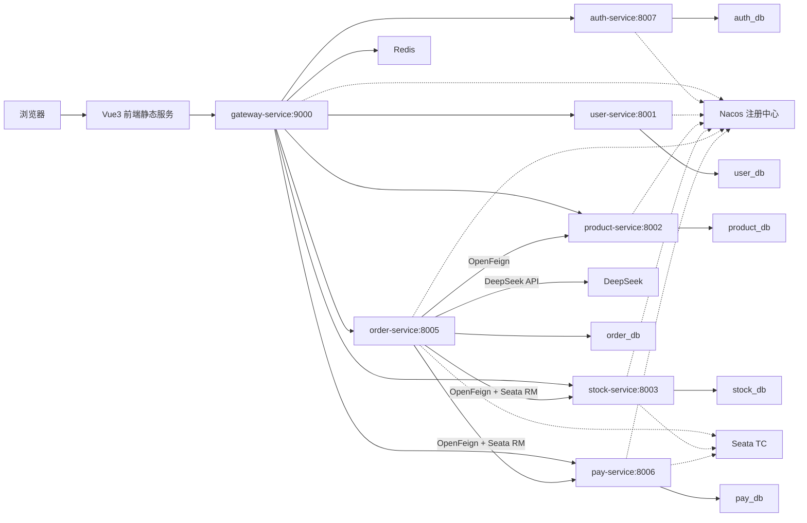
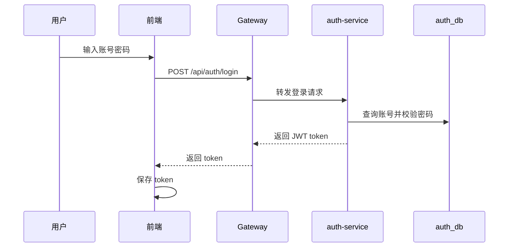
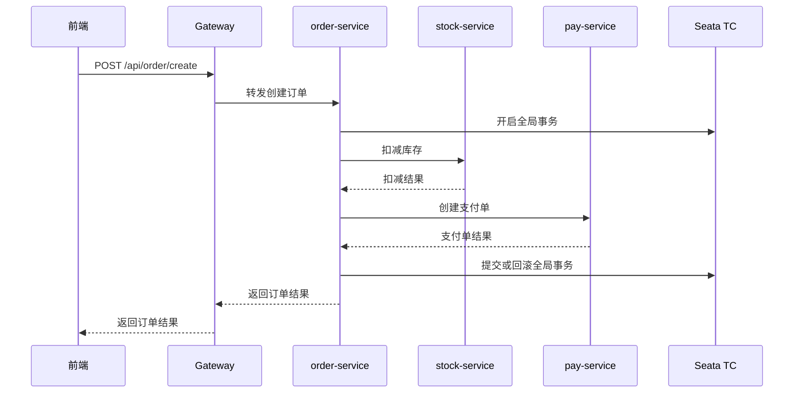

# 企业级智能分销与订单履约平台架构与接口文档

## 1. 系统架构



## 2. 数据库划分

系统按照服务边界进行数据库拆分：

| 数据库 | 所属服务 | 说明 |
| --- | --- | --- |
| auth_db | auth-service | 登录账号、角色、权限 |
| user_db | user-service | 用户信息 |
| product_db | product-service | 商品、分类、浏览历史 |
| stock_db | stock-service | 库存、仓库、Sentinel 规则、undo_log |
| order_db | order-service | 订单、订单明细、AI 聊天记录、事务审计、undo_log |
| pay_db | pay-service | 支付单、undo_log |

## 3. 核心链路

### 3.1 登录鉴权链路



### 3.2 订单履约链路



## 4. 接口文档

### 4.1 auth-service

| 接口名称 | 所属服务 | 请求方式 | 请求路径 | 参数列表 |
| --- | --- | --- | --- | --- |
| 登录 | auth-service | POST | /api/auth/login | username String；password String |
| token 校验 | auth-service | GET | /api/auth/validate | Authorization String |

### 4.2 user-service

| 接口名称 | 所属服务 | 请求方式 | 请求路径 | 参数列表 |
| --- | --- | --- | --- | --- |
| 用户列表 | user-service | GET | /api/user/list | 无 |
| 用户详情 | user-service | GET | /api/user/{userId} | userId Long |

### 4.3 product-service

| 接口名称 | 所属服务 | 请求方式 | 请求路径 | 参数列表 |
| --- | --- | --- | --- | --- |
| 商品列表 | product-service | GET | /api/product/list | 无 |
| 商品详情 | product-service | GET | /api/product/{productId} | productId Long |
| 新增商品 | product-service | POST | /api/product/create | 商品 JSON |
| 新增商品 | product-service | POST | /api/product | 商品 JSON |
| 修改商品 | product-service | PUT | /api/product/{productId} | productId Long；商品 JSON |
| 删除商品 | product-service | DELETE | /api/product/{productId} | productId Long |
| 浏览历史 | product-service | GET | /api/product/browse-history/{userId} | userId Long |
| 商品配置 | product-service | GET | /api/product/config | 无 |

### 4.4 stock-service

| 接口名称 | 所属服务 | 请求方式 | 请求路径 | 参数列表 |
| --- | --- | --- | --- | --- |
| 库存列表 | stock-service | GET | /api/stock/list | 无 |
| 按商品查询库存 | stock-service | GET | /api/stock/product/{productId} | productId Long |
| 扣减库存 | stock-service | POST | /api/stock/deduct | productId Long；quantity Integer |
| 仓库列表 | stock-service | GET | /api/stock/warehouse/list | 无 |
| Sentinel 规则 | stock-service | GET | /api/stock/sentinel/rules | 无 |
| undo_log 数量 | stock-service | GET | /api/stock/seata/undo-log/count | 无 |

### 4.5 order-service

| 接口名称 | 所属服务 | 请求方式 | 请求路径 | 参数列表 |
| --- | --- | --- | --- | --- |
| 订单看板 | order-service | GET | /api/order/dashboard | 无 |
| 经营分析 | order-service | GET | /api/order/analysis | 无 |
| 订单汇总 | order-service | GET | /api/order/summary | 无 |
| 订单列表 | order-service | GET | /api/order/list | 无 |
| 跨服务订单详情 | order-service | GET | /api/order/remote-detail/{orderNo} | orderNo String |
| 创建订单 | order-service | POST | /api/order/create | userId Long；productId Long；quantity Integer；simulateError Boolean |
| Seata 事务链路 | order-service | GET | /api/order/seata/flow | 无 |
| AI 客服聊天 | order-service | POST | /api/order/ai/chat | userId Long；message String |
| Prompt 模板 | order-service | GET | /api/order/ai/prompt-template | 无 |
| AI 智能推荐 | order-service | GET | /api/order/ai/recommendations | userId Long |

### 4.6 pay-service

| 接口名称 | 所属服务 | 请求方式 | 请求路径 | 参数列表 |
| --- | --- | --- | --- | --- |
| 支付列表 | pay-service | GET | /api/pay/list | 无 |
| 按订单查询支付单 | pay-service | GET | /api/pay/order/{orderNo} | orderNo String |
| 创建支付单 | pay-service | POST | /api/pay/create | orderNo String；amount BigDecimal |
| undo_log 数量 | pay-service | GET | /api/pay/seata/undo-log/count | 无 |

### 4.7 gateway-service

| 接口名称 | 所属服务 | 请求方式 | 请求路径 | 参数列表 |
| --- | --- | --- | --- | --- |
| 服务治理总览 | gateway-service | GET | /api/governance/overview | 无 |
| 流量监控 | gateway-service | GET | /api/governance/traffic | 无 |
| 系统监控 | gateway-service | GET | /api/governance/system-monitor | 无 |

## 5. Swagger 地址

| 服务 | 地址 |
| --- | --- |
| Gateway | http://localhost:9000/swagger-ui/index.html |
| auth-service | http://localhost:8007/swagger-ui/index.html |
| user-service | http://localhost:8001/swagger-ui/index.html |
| product-service | http://localhost:8002/swagger-ui/index.html |
| stock-service | http://localhost:8003/swagger-ui/index.html |
| order-service | http://localhost:8005/swagger-ui/index.html |
| pay-service | http://localhost:8006/swagger-ui/index.html |

## 6. Docker 一键启动

项目根目录下执行：

```bash
cp .env.example .env
./scripts/docker-up.sh
```

启动后访问：

```text
http://localhost:5173
```

默认账号：

```text
admin / 123456
```
